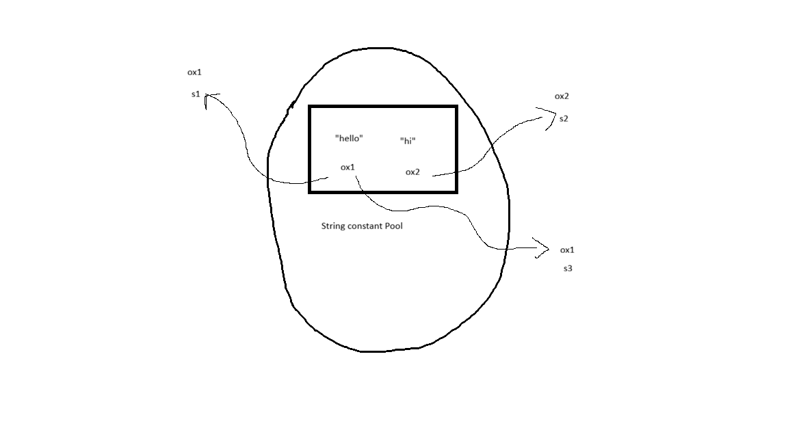
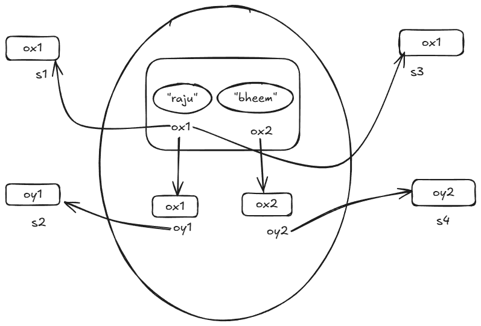
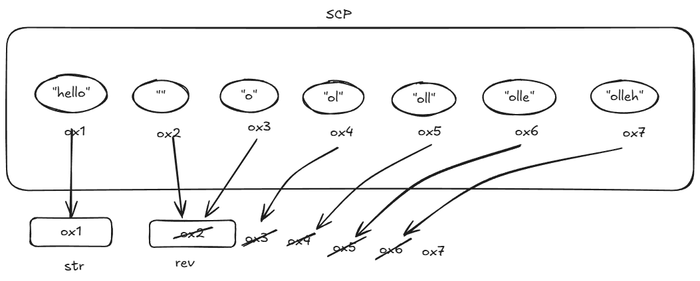
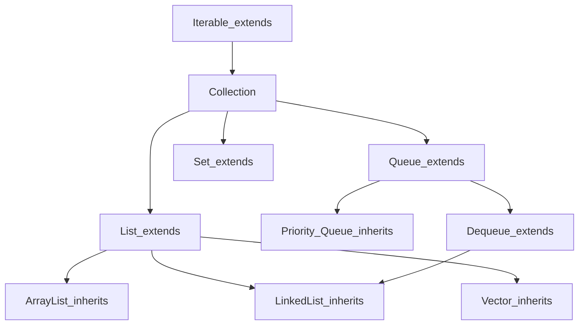

# Method Shadowing

- If the parent class and child class both having same _static method_ it is called Method Shaowing.
- If we are creating the reference for child class it will give priority to child class method.
- If we are creating the reference for parent class it will give priority to parent class method.
- Method shadowing is also called as Method Hiding.

Note: It is checking the reference not the object.

## Rules of Method Shadowing :

- Method name should be same
- Return type of method should be same
- Formal arguements should be same
- Method should be _static_
- Access Modifier should be same or higher

_public -> protected -> default -> private_

# Variable Shaowing

- If the parent class and child class both having same _variable_ it is called Variable Shaowing.
- If we are targetting by the parent reference it will take parent class variable and if we are targetting by the child reference it will take child class variable.
- If global and local both variable is same any block it will give more priority to the local variable.

Ex:

```java
    class Demo1 {
        int x = 10;
        void m1() {
            int x = 50;
            System.out.println(x);
        }
    }

    class Demo2 extends Demo1 {
        int x = 20;
    }

    class Main {
        public static void main (String [] args) {
            Demo1 d1 = new Demo1();
            System.out.pritnln(d1.x);//10
            Demo2 d2 = new Demo2();
            System.out.println(d2.x);//20
            Demo1 d3 = new Demo2();
            System.out.println();
        }
    }
```

## Can we provide method body inside interface??

- For non static method we can't provide method body because they are by default abstract.
- But for static method we can provide method body.
- This static method will not inherit to another class.

Ex:

```java
interface A {

    void m1();

    static void m2() {
    	System.out.println("I am m2, static method of Interface");
    }

    void m3();

}

interface C extends A {

}

class B implements A {

    @Override

    	public void m1() {
    		System.out.println("I am m1");
    	}

    	public void m3() {
    		System.out.println("I am m3");
    	}

}

class Interface1 {
    public static void main(String[] args) {
    	System.out.println("Hello World!");
    	B ob1 = new B();
    	ob1.m1();
    	A.m2();
    	ob1.m3();
        ob1.m2(); // not possible
        C.m2(); // not possible
    }

}
```

## Types of Interface :

- In java, we have 3 types of interface

1. Regular Interface :

   In this interface we can take n number of static methods, abstract methods and constants.

Ex:

```java
interface A {
   int x = 10;
   String str1 = "How are you?";
   void m1();
   void m2();
   static void m3() {
   }
   static void m4() {
   }
}
```

2. Fuctional Interaface :

- In this type of interface we can declare only one abstract method.
- For creating this interface we have to use have to use @FunctionalInterface annotation
- We can provide

3. Marker Interface :

- This type of interface does not have any methods and constants.
- It is used to mark or send some special signal to JVM.

# Object Class

- Object Class is the supermost parent class / root class in java class hierarchy.
- It is present in java.lang.package
- In object class there is 11 nonstatic methods.

## To String Method

- This method is present in _Object Class_.
- It is returning _classname@hexadecimal_ value as String.
- _toString() method in Object Class_

Ex:

```java
public String toString() {

    return getClass().getName() + "@" + Integer.toHexString(hashCode());

}
```

## Code without override of toString()

```java
class Emp {

    String ename;
    int eid;
    Emp(String ename, int eid) {
        this.ename = ename;
        this.eid = eid;
    }
    public static void main(String[] args) {
        Emp e1 = new Emp("Smith", 101);
        System.out.println(e1);
        System.out.println(e1.toString());
    }

}


O/P: Random hashcode
Emp@12345eg
Emp@12345eg
```

## Code with override of toString()

```java
class Emp {

    String ename;
    int eid;
    double sal;
    String loc;

    Emp(String ename, int eid, double sal, String loc) {
        this.ename = ename;
        this.eid = eid;
        this.sal = sal;
        this.loc = loc;
    }

    @Override
    public String toString() {
        return "Ename : " + ename + "\nEid : " + eid + "\nSal : " + sal + "\nLoc : " + loc;
    }

}

class Office {
    public static void main(String[] args) {
        Emp e1 = new Emp("Smith", 101, 90000, "Chennai");
        System.out.println(e1.toString());
    }

}
```

# Equals Method

- If we are using "==" operator, it check the address, not the content.
  Ex:

```java
    Emp e1 = new Emp("Miller",101);
    Emp e2 = new Emp("Scott",102);
    Emp e3 = new Emp("Miller",101);
    System.out.println(e1==e2); //false
    System.out.println(e1==e3); //false
```

- To overcome this we have to use _equals()_ method.
- _equlas()_ method will check _not the address, it checks the address_

**Note :**\
_equals() method without overrdie_

```java
    System.out.println(e1.equals(e2)); //false
    System.out.println(e1.equals(e3)); //false
    // without override it will not check the content
```

_equals() method with overrdie_

```java
@Overide
public boolean equals(Object obj ) {//upcast
    //downcast
    Emp e = (Emp) obj;
    retunr this.ename.equals(e.ename) && this.eid == e.eid;
}
    // now it will check the content
    System.out.println(e1.equals(e2)); //false
    System.out.println(e1.equals(e3)); //true
```

# Anonymous Class

- Any class that does not have any name, is called Anonymous Class.

_Syntax_

    interface ref_var = new interfacename {
        @Override
    };

Ex:

```java
interface Calculate{
    void m1();
}
class Calculator {
    public static void main(String args[]){
        Calculate c = new Calculate() {
            @Override
            public void add() {
                System.out.println("This is add method");
            }
        }
    }
}
```

# Exception

- Exception is an unwanted event that occurs during the execution of program.
- It happens because of some abnormal statement.
- For this the normal flow of a program execution will be errupted.

Ex:

Going to attend world class best _santanu sir_ batch, suddenly rain came.

## Types of Exception :

1. Unchecked Exception
2. Checked Exception

# Unchecked Exception

- The exception, compiler is not aware of or complier does not know about the exception is called as Uncehcked Exception.
- Unchecked Exception is compile time success but run time error

Ex:

```java
class A{
    public static void main(String []args ){
        int a = 20, b = 0;
        System.out.println("Start");
        System.out.println(a+b);
        System.out.println(a-b);
        System.out.println(a*b);
        System.out.println(a/b);
        System.out.println("End");
    }
}
```

_Note :_
For the abnormal statement `sop(a/b)`, it occurs Exception and it will stop the normal execution flow.

--Missed Notes--

## What is _throws_ keyword?

- In Java, the `throws` keyword is used in a method declaration to indicate that the method might throw one or more specific exceptions during its execution.

- It informing the compiler and the caller that this method won't handle the exception itself and that the caller is responsible for dealing with it.

## Exception Propagation

- Transfering the Exception Handling from one method to the caller method is called as _Exception Propagation_

- For checked Exception, propagation can be done explicitely by using `throws` keyword.

- If it is unchecked Exception, propagation will happen implicitely, we need not to use `throws` keyword.

**Exception Propagation Unchecked Exception**

Ex:

```java
public class Propagation {

    public static void m1() {
        for(int i=1; i<=10; i++){
            System.out.println(i);
            Thread.sleep(500);
        }
    }

    public static void m2() throws Exception {
        System.out.println("I am m2");
        m1();
    }

    public static void m3() throws Exception {
        System.out.println("I am m3");
        m2();
    }

    public static void main(String[] args) {
        try {
            m3();
        } catch (Exception e) {
            System.out.println("Thread Exception is handled");
        }
    }
}
```

## What is Throwable Class?

- The java.lang.Throwable class is the root superclass of all errors and exceptions in the Java language.

_methods_ => `toString()`, `getMessage()`, `printStackTrace()`

Ex:

```java
class Example{
    public static void main(String args[])
    int a[] = {10, 3};
    try{
        System.out.println(a[6]);
    }
    catch(Throwable t){
        System.out.println(t.toString());
        System.out.println(t.getMessage());
        t.printStackTrace();
    }
}
```

## `throw` keyword

- The `throw` keyword in Java is used to explicitly throw an exception from a method or any block of code.

- Mainly it is used for throwing _custom exception_.

- It can only throw one exception object at a time.

_Syntax_

throw object Of Exception type ("Message")

Ex:

```java
class Example {
    public static void main(String args[]){
        System.out.println("Start");
        int age = 9;
        if(age>21)  System.out.println("You can ride bike.");
        else throw new ArithemeticException("You can't ride.");
        System.out.println("End");
    }
}
```

## Difference between throw and throws

| `throw`                                                | `throws`                                                    |
| ------------------------------------------------------ | ----------------------------------------------------------- |
| Used to explicitly throw an exception.                 | Used to declare potential exceptions in a method signature. |
| Used inside a method or a block of code.               | Used in the method signature.                               |
| Followed by an instance (e.g., throw new Exception()). | Followed by class names (e.g., throws IOException).         |
| Can throw only one exception at a time.                | Can declare multiple exceptions separated by commas.        |
| The method itself triggers the exception.              | Delegates exception handling to the caller of the method.   |

# Custom Exception

- A custom exception (also called a user-defined exception) in Java is a specific excpetion class created by a program to handle error scenarios based on their application.

- Custom Exception, we can create both for checked and unchecked exception.

## How to create Checked Custom Exception??

- We have to create one class and that class should inherit from _Exception Class_

_Syntax_

```java
class ClassName extends Exception{
    ClassName(String msg){
        super(msg);
    }
}
```

## Difference between `final`, `finally` and `finalize`

### `final`

- It is one keyword, modifier.

- We can apply it to variable, class, methods.

- It is used to make constant.

- Final variable we can't change the value, final class we can't inherit final method we can't override.

### `finally`

- finally is a block.

- It is written with try or try and catch block.

- It will execute everytime irrespective of exception is handled or not handled.

### `finalize`

- finalize is one method.

- It is present in Object class.

- It is used for cleanup(To remove the object from the heap area who does not have any reference).

- It is called by _System.gc()_ method.

# Wrapper Class

- Java is not fully object oriented language because here we are using primitive datatypes.

- A wrapper class in Java is a class that wraps a primitive data type inside an object.

- All the wrapper class are present in `java.lang` package

- For each 8 primitive datatypes java has corresponding 8 wrapper class.

| Primitive Datatype | Wrapper Class |
| ------------------ | ------------- |
| byte               | Byte          |
| short              | Short         |
| int                | Integer       |
| long               | Long          |
| float              | Float         |
| double             | Double        |
| char               | Character     |
| boolean            | Boolean       |

## Boxing

- _Boxing_ in Java is the process of converting a primitive data type into its corresponding object wrapper class.

_Syntax:_

```java
    wrapperclass ref = wrapperclass.valueOf(primitivedata);
```

_Example:_

```java
class Example {
    public static void main(String args[]) {
        int a = 10;
        Integer ob1 = Integer.valueOf(a);
        System.out.println(a);              //Possible
        System.out.println(ob1);            //Possible
        System.out.println(ob1.toString()); //Possible
        System.out.println(a.toString());   //Not Possible
    }
}
```

## Unboxing

- _UnBoxing_ in Java is the process of converting an object wrapper class into its corresponding primitive data type.

_Example:_

```java
class Example {
    public static void main(String args[]) {
        int a = 10;
        Integer ob1 = Integer.valueOf(a); //Boxing
        int b = ob1.intValue(); //Unboxing
        System.out.println(b);
    }
}
```

## Auto Boxing and Auto Unboxing

- _AutoBoxing_ in Java is the automatic coversion that the Java complier makes between primitive data types (like int, double, char, etc) and their corresponding object wrapper classes (like Integer, Double, Character, etc).

- For performing _AutoBoxing_ no need to use `valueOf()` method.

- _AutoUnoxing_ is the process of automatically converting Wrapper class objects into primitive datatypes.

_Example:_

```java
public class Auto {
    public static void main(String[] args) {
        int a = 10;
        // Auto Boxing
        Integer ob1 = a;
        System.out.println(ob1.toString());
        // Auto Unboxing
        int b = ob1;
        System.out.println(b);
    }
}
```

# String

- `String` is collection of characters enclosed with double quotes

- We can create string in 2 ways
  1. By using string literals
  2. By using

## String Methods

1. `length()`
   - This method is used to know the size/length of the string.

   - return type of this method is `integer`.

   Syntax : `stringVar.length();`

   Ex:

   ```java
   String myName = "Goutham";
   int len = myName.length();
   System.out.println(len);
   // Output: 7
   ```

2. `charAt()`
   - This method is used to know which character is present at the given index.

   - return type is `char`.

   Syntax : `stringVar.charAt(index);`

   Ex:

   ```java
   String greet = "Good Morning";
   char ch = greet.charAt(2);
   System.out.println(ch);
   // Output : o
   ```

3. `indexOf()`
   - This method is used to know the index of the given character in the String.

   - return type is `int`.

   - This method will take _first occurance of the given character_

   Syntax : `stringVar.indexOf('char')`

   Ex:

   ```java
   String empName = "miles moralas";
   System.out.println(empName.indexOf('m'));
   System.out.println(empName.indexOf('l'));
   /*Output :
   0
   2
   */
   ```

4. `lastIndexOf()`
   - This method is used to know the last index of the given character in the String.

   - return type is `int`.

   Ex:

   ```java
   System.out.println(empName.lastIndexOf('m'));
   System.out.println(empName.lastIndexOf('l'));
   /*Output :
   6
   10
   */
   ```

5. `toUpperCase()`
   - This is used to convert the string into uppercase and it will return one new string.

   - It will not modify the original string.

6. `toLowerCase()`
   - This is used to convert the string into lowercase and it will return one new string.

   - It will not modify the original string.

   Ex:

   ```java
   String msg = "Good Morning";
   String upper = msg.toUpperCase();
   System.out.println(upper);   // GOOD MORNING
   String lower = msg.toLowerCase();
   System.out.println(lower);   // good morning
   System.out.println(msg);     // Good Morning
   // Doesn't affect the original string
   ```

### How to get String data from user?

Step-1 -> First we need Scanner class

Step-2 -> We have two methods, `next()` and `nextLine()`.

- `next()` method can take only single word but `nextLine()` can take a line/ sentence form the user.

7. `equals()`
   - This method is used to compare between two strings values and it will return boolean.

   ```java
   import java.util.Scanner;

   public class Program2 {
       static Scanner sc = new Scanner(System.in);

       public static void main(String[] args) {
           System.out.print("Enter your email : ");
           String email1 = sc.next();
           System.out.print("Enter your email again : ");
           String email2 = sc.next();
           if (email1.equals(email2))
               System.out.println("Both the email are same.");
           else
               System.out.println("Both email are not same");
       }
   }

   ```

### String Class

- `String` is one in-build class in Java and it is present in `java.lang` package.

- It is one non-primitive datatype also.

- Inside `String` class `equals()`, `toString()`, `hashCode()` methods are overrided.

- `String` is one final class. We cannot inherit String class inside another class.

#### Creating String by using new keyword

```java
String subject1 = new String("Java");
```

- When we are creating any string by using String literals it will create object inside _String Constant Pool_ that is present inside Heap area.

- If we are creating same string again, then it won't create one more new object in _String Constant Pool_. Both the String variable share the same object address.

Ex 1:

```java
String s1 = "Hello";
String s2 = "Hi";
String s3 = "Hello";
System.out.println(s1 == s2); //False (Address Not Same)
System.out.println(s1 == s3); //True (Address Same)
System.out.println(s1.equals(s3)); //True(Content Same)
```



Ex 2:

```java
String s1 = "Raju";
String s2 = new String("Raju");
String s3 = s1;
String s4 = new String("Bheem");
```



#### String is Immutable

- We can't modify the original

Ex 1:

```java
String s1 = "hello";
System.out.println(s1);     //hello
s1 = s1 + "hi";
System.out.println(s1);     //hellohi

String s3 = "h1";
System.out.println(s3);     //hi
s3 = s3.toUpperCase();
System.out.println(s3);     //HI
```

Ex 2:

```java
String str = "hello";
String rev = "";
for(int i=str.length()-1; i>=0 ;i--){
    rev = rev + str.charAt(i);
}
System.out.println(rev);
```



### String Class Constructor

1. `String()`

2. `String(char arr[])`

3. `String(byte arr[])`

4. `String(StringBuilder var)`

5. `String(StringBuffer var)`

6. `String(String var)`

#### How to convert char array into String

```java
char charArr[] = {'g','o','u','t','h','a','m'};
String name = new String(charArr);
System.out.println(name); //goutham
```

8. `equalsIgnoreCase()`

- It is used to compare strings irrespective of case. It will return boolean.

```java
String s1 = "hello";
String s2 = "Hello";
System.out.println(s1.equals(s2)); //false
System.out.println(s1.equalsIgnoreCase(s2)); //true
```

9. `toCharArray()`

- This method is used to covert any String into character array.

```java
String s1 = "hello";
char arr[] = s1.toCharArray();
System.out.println(Arrays.toString(arr));

// Output : ['h','e','l','l','o']
```

_Notes:_

- Small Character('a' to 'z') - 32 = Captial Character('A' to 'Z')

- Captial Character('A' to 'Z') + 32 = Small Character('a' to 'z') - 32

- Any Number Character ('0' to '9') - 48 = Integer Number (0 to 9)

# Collection Framework

## Object Class

- Object Class is the parent of all other classes in Java.

```java
//Upcasting and AutoBoxing is happening
Object o1 = 1; //-> It will convert Primitive Datatype into Non-Primitive Datatype by AutoBoxing
Object o2 = 'A';
Object o3 = true;
Object o4 = "Hello";
Object o5 = new Student(1,"Tom", 45);
```

Ex:

```java
public class Demo{
    public static void main(String args[]){
        Student s = new Student();
        Object arr[] = {1, "Dinga", true, 'A', null, s};
        for(int i=0; i<arr.length; i++){
            System.out.println(arr[i]);
        }
    }
}
/* Output:
1
Dinga
true
A
null
s@1301(Random address)
*/
```

1. Write a program to print student details those who marks greater than 65.

## Framework

- Framework is an readymade architecture which consists of set of classes and interfaces.

Ex:

- For backend we have -> Hibernate, Spring, SpringBoot
- For frontend we have -> Angular, view JS
- For testing we have -> Cucumber, playwright

### Why wdo we need collection Framework in Java?

- To store multiple objects or group of objects together we can generally use arrays.
- But arrays has some limitations.

#### Limitations of Array :

- The size of the array is fixed, we cannot reduce or increase dynamically during the execution of the program.
- Array is a collection of homogeneous elements.
- Array manipulation such as
  1. Removing an element from an array.
  2. Adding the element in between the array etc.

  Requires complex logic to solve.

Therefore, to avoid the limitations of the array we can store the group of objects or elements using different data structures such as:

1. List
2. Set
3. Queue
4. maps / dicitions

## Def of Collection Framework

- Collection Framework is set of classes and interfaces (hierachies), which provides mechanism to store group of objects (elements) together.

- It also provides mechanism to perform actions such as :

  (CRUD - operations)
  1. Create and add an element
  2. Access the elements
  3. Remove / Delete the elements
  4. Search Elements
  5. Update Elements
  6. Sort Elements

## Difference between Array and Collection

| Array                                                        | Collection                                                |
| ------------------------------------------------------------ | --------------------------------------------------------- |
| Fixed in Size                                                | Dynamic in Size                                           |
| Will accept only Homogenous type of data                     | Will accept both Homogenous and Heterogenous type of data |
| No pre-defined methods                                       | We have many pre-defined methods                          |
| Array will accept both primitive and non-primitive datatypes | Collection will accept only non-primitive datatypes       |
| Array does not support generic                               | Collection support generic                                |



## Collection Classification

We can classify co,lections into 2 categories:

1. Non-generic collection
2. Generic Collection

### Non-Generic Collection

- It is heterogeneous collection of elements.
- Every element is coverted and stored as java.lang.ObjectClass type.

### Generic Collection

- It is a homogeneous collection of elements, (collection of same type of elements).

#### Syntax to create Generic Colleciton :

1. Syntax to create reference variable for Generic Collection:

   Collection_Type < Non-primitive > variableName = new Collection_Type < NP >;

   ArrayList< Integer > ls;

2. Syntax to create Generic Colleciton Object :

   new Colleciton_name < Datatype > ();

   new ArrayList < Integer > ();

ArrayList < Integer > ls = new ArrayList < Integer >();
arraylist where we can store only integers

From JDK 7 onwards..

ArrayList < Integer > ls = new ArrayList <>();

Ex:

```java
import java.util.ArrayList;
public class Demo {
    public static void main (String args[]) {
        ArrayList<Integer> a1 = new ArrayList<Integer>();
        a1.add(1);
        a1.add(2);
        a1.add(3);
        a1.add(4);
        a1.add(5);
        System.out.println(a1);
    }
}
```

## for each loop :

- For each loop is an advanced version of traditional for loop.
- And it is also called as Enchanced for loop.

Syntax:

ClassName < NP > = new ClassName();
for each loop -> arr/coll

for(DataType var : arr/coll) {

}

Ex:

```java
import java.util.ArrayList;
public class Demo {
    public static void main (String args[]) {
        ArrayList a1 = new ArrayList();
        a1.add(1);
        a1.add("Tom");
        a1.add(true);
        a1.add(4.5);
        a1.add(6849727352);
        a1.add(null);
        //Traditional for loop
        for(int i=0; i<a1.size(); i++){
            System.out.println(a1.get(i));
        }
        System.out.println("----------------------");
        for(Object o : a1) {
            System.out.println(o);
        }
    }
}
```
